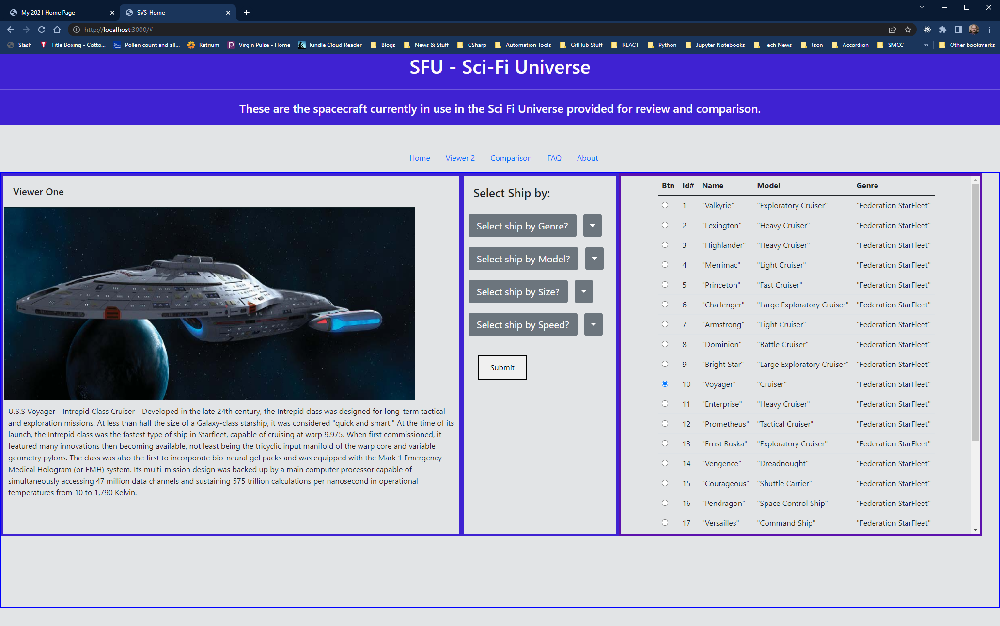

# compare-ships
## Motivation
A project to experiment with some JavaScript.
## Build status
Self-contained HTML webpages stored in a folder, along with images, CSS file and JavaScript needed for support. JSON server and lite-server are also installed. 
## Screenshots

## Tech/Framework
Visual Studio Code, HTML 5, CSS, JavaScript, JSON-Server, Lite-Server, Node, Bootstrap.
## How to use?
This is a HTML application.
1.	Just download this to you preferred computer location.  
2.	Open with Visual Studio Code.
3.	Using the split terminal option in the first terminal run json-server --watch db.json command to start the Jason Server in LocalHost:3000
4.	In the second terminal type npm start , this will launch application in browser on LocalHost:3001
## Credits
TO-DO
## License
It probably doesn’t need any kind of licensing, but in keeping with GitHub’s preferred practices and recommendations. I have placed this under the provisions and guidelines of an MIT License. 
MIT © [Gilbert Gonzales]()

